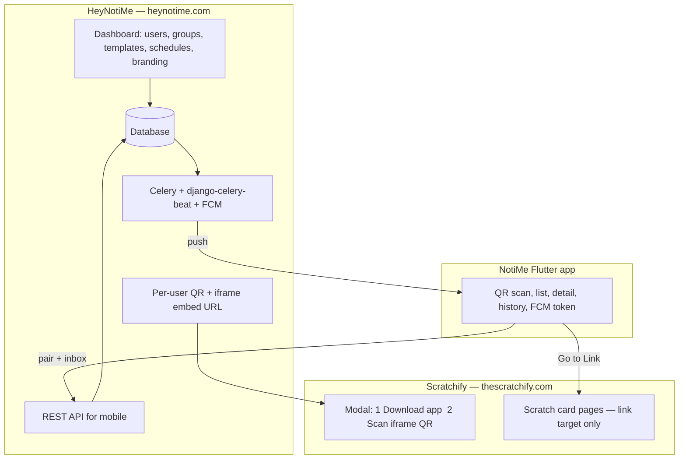

# NotiMe v1 — Scope & client confirmations

**Last updated:** May 2026  
**Budget context:** ~$800 first version (UI + agreed backend/mobile integration path)  
**Repos:**

| Product | Location | Role |
|---------|----------|------|
| NotiMe Flutter app | `Scratchify-App Task-Poland` (this repo) | End-user mobile app |
| HeyNotiMe backend + dashboard | `E:\Projects\2026\5.May\NotiMe` | Notifications, API, Celery, FCM |
| Scratchify website | `thescratchify.com` (separate) | Gameplay + QR iframe modal only in v1 |

---

## Business goal (why v1 exists)

- Turn one-time Scratchify visitors into **returning** customers via **daily** (or scheduled) free scratch card reminders.
- Push + in-app notification list on the phone; users tap through to Scratchify to play.
- HeyNotiMe owns the notification system; Scratchify does **not** send pushes or host the notification API.
- Scratchify → HeyNotiMe user sync on **registration** is a **later** task (separate budget).

---

## Three products — responsibilities

| System | v1 responsibility |
|--------|-------------------|
| **HeyNotiMe** | Configure campaigns, store users/groups, generate per-user QR, send pushes, serve notification list/history API, store FCM device tokens |
| **NotiMe app** | Scan QR, pair session, show list from HeyNotiMe API, open template URL in browser, register for FCM |
| **Scratchify** | Show modal (download + iframe QR); **no** notification API; registration sync to HeyNotiMe **out of scope** |

---

## Client confirmations (checklist)

### 1. QR code & scratch card link

| # | Decision |
|---|----------|
| 1.1 | QR lives in **end-user account on heynotime.com**, embeddable as **iframe** in Scratchify (and other apps). **Unique per user** for pairing. |
| 1.2 | Scratch card link in campaigns: **manual** in dashboard (`NotificationTemplate.url`). |
| 1.3 | Owner sets link at [set-notification](https://heynotime.com/dashboard/set-notification/). |

**QR payload (agreed concept):**

- Application / company identifier (`app-slug` or app name)
- Unique user token for secure pairing
- Format: **URL or JSON** — pick **one canonical format** in implementation (recommend URL: `https://heynotime.com/{app-slug}/{token}`).

### 2. Link per group

- Link is **not** global for all users.
- Each **group** receives a specific **notification schedule** bound to a **template** (with its own link).
- Example: Group 1 → Template A + link A; Group 2 → Template B + link B.
- Same URL for all users in that campaign instance; personalize opens via `?user=` (or equivalent) when needed.

### 3. End users in HeyNotiMe

| Phase | Rule |
|-------|------|
| **v1** | Users added on **HeyNotiMe side only** (dashboard). No Scratchify → HeyNotiMe API in this stage. |
| **Later** | Scratchify sends users via API (JSON / GET/POST) for pairing/sync. |

### 4. QR scan — users & groups

| # | Decision |
|---|----------|
| 4.1 | On scan: **auto-add to default group** so customers are not lost if pairing/API fails. Full link/sync when pairing succeeds. **App name required in QR.** |
| 4.2 | Same person may exist on Scratchify and HeyNotiMe separately until linked. |
| 4.3 | QR links **one phone ↔ one HeyNotiMe session**; does **not** import owner’s full user list into the app. |

**Interpretation:** Scan may **create** HeyNotiMe user if missing + assign default group; pre-creating users in dashboard remains optional.

### 5. NotiMe app — notification list

- After QR login, list (and detail) loaded from **HeyNotiMe API / database** — **not** Scratchify.

### 6. Scheduler

- **Celery + django-celery-beat** on HeyNotiMe server — **approved**.

### 7. Recurrence

- **“Every 2 days” not required** for v1.
- Sufficient: **once**, **daily**, **weekly**, **monthly** (matches current `Notification.recurring_notification` choices).

### 8. Expired notifications (grey rows)

- **Single source of truth:** `NotificationTemplate.available_to` only.
- When past `available_to`, notification is unavailable / shown expired in app.
- **Do not** use `notification_time` for in-app expiry in v1 (field may remain in DB for other purposes or UI ignore).

### 9. “Integrated with Scratchify”

- All notification config, sending, inbox, push = **HeyNotiMe only**.
- Scratchify v1 UI: **modal** with two steps — (1) Download the app, (2) Scan me (iframe QR).
- QR contains app name + user identifier (link or JSON).
- Scratchify → HeyNotiMe on registration = **future**, not v1.

### 10. Push (Firebase / FCM)

**Clarification for client:**

- One **Firebase (FCM)** project for the **NotiMe** store app (Android + iOS).
- App sends **device token** to HeyNotiMe; server stores per user/device and sends pushes via Celery.
- Scratchify does **not** need its own Firebase for this flow.

**Pending explicit client “yes” on FCM storage model — technically required for background push.**

### 11. System connections

| Connection | v1 |
|------------|-----|
| NotiMe ↔ HeyNotiMe | Pairing, notification list, history, push registration, templates & schedules (via API) |
| Scratchify ↔ NotiMe | **No** direct notification API |
| Scratchify | iframe QR from HeyNotiMe; open scratch card URL in **browser** from notification tap |
| Scratchify → HeyNotiMe data | Registration-stage API — **later** |

---

## HeyNotiMe database (existing vs v1 build)

### Already in `authentication/models.py`

| Model | Purpose |
|-------|---------|
| `Company` | Branding (logo, name) — header in mobile app per integration owner |
| `CustomUser` | End users + dashboard owners; `user_token`, `owner_id` |
| `UserGroup` | Audiences (Group 1, Group 2, …) |
| `NotificationTemplate` | Content: title, description, image, **url**, **available_to** |
| `Notification` | Schedule: group/user, template, recurrence, timezone, `send_at`, etc. |

### To build for v1 (backend)

| Item | Purpose |
|------|---------|
| `Integration` (or equivalent) | App slug, display name, link to `Company`, default group |
| `PairingToken` | Short-lived token in QR; ties to user + integration |
| Per-user QR + **iframe embed** route | Dashboard + embed URL for Scratchify modal |
| `Device` | FCM token per user/platform |
| `NotificationDelivery` (inbox) | Rows for Flutter list + history (sent_at, link_clicked) |
| REST API (`/api/v1/...`) | Pair, devices, notifications, integrations/branding |
| Celery tasks + beat | Create deliveries, send FCM, respect recurrence |
| Pairing view | `GET /{app-slug}/{token}` optional success redirect for web |

### Known backend fixes (before production)

- `set_notification_time` sets `obj.user` but `Notification` has no `user` field.
- `NotificationTemplate.proper_name` required in DB but omitted from create form.
- No REST API or Celery wiring in repo today (deps listed, not used).

---

## NotiMe Flutter app (this repo)

### Done (UI prototype — mock data)

- QR starter screen (demo payload; align to real URL/JSON).
- Home: notifications tab + history tab.
- Per-app pages (`/home/:appId`), account menu, Scratchify header + list tiles.
- Notification detail + “Go to Link” (`?user=` append).
- Add-app flow (second QR).
- Android debug APK build path documented in `README.md`.

### v1 implementation (replace mocks)

| Task | Notes |
|------|--------|
| QR parser | `https://heynotime.com/{slug}/{token}` and/or JSON; register app slug |
| Pairing API client | Exchange token → session; store securely |
| FCM | Register token → `POST` devices endpoint |
| Notifications repository | `GET` inbox per integration; map `available_to` → expired UI |
| Branding | Logo/name from HeyNotiMe API (`Company` / integration) |
| Deep links | App Links / universal links for same QR URL |
| Remove / gate mock `MockData` | Feature flag or env for demo vs production |

### Out of scope (v1 Flutter)

- Scratchify REST client for notifications.
- Blockchain / expanded reward types.
- Scratchify registration sync API.
- App Store / Play production release pipeline (unless explicitly added).

---

## API sketch (HeyNotiMe — to implement)

Base: `https://heynotime.com/api/v1/` (staging TBD)

| Method | Endpoint | Purpose |
|--------|----------|---------|
| `POST` | `/pair/` or `GET /pair/{slug}/{token}/` | Validate QR token; create/link user; default group; return session |
| `POST` | `/devices/` | Register FCM token |
| `GET` | `/integrations/` | Connected apps + branding for menu |
| `GET` | `/integrations/{slug}/notifications/` | Inbox list (`available_to`, image, title, url) |
| `GET` | `/notifications/history/` | Sent + link_clicked |
| `GET` | `/users/me/qr/` or embed | Per-user QR image/URL for iframe |

Exact paths to match Django implementation.

---

## Scratchify website (v1 — separate task)

- Modal: step 1 “Download NotiMe”, step 2 iframe pointing to HeyNotiMe embed QR URL.
- No direct NotiMe ↔ Scratchify API for notifications.
- Registration → HeyNotiMe user API: **not in v1**.

---

## Open items (short client ping)

1. Confirm **one** QR format for v1: URL vs JSON (recommend URL).
2. **Default group** name/slug when auto-adding on scan.
3. Explicit **yes** on one Firebase project + FCM tokens stored in HeyNotiMe.
4. Whether `notification_time` should be hidden in dashboard (expiry is `available_to` only).

---

## Implementation order

1. **HeyNotiMe:** Models + pairing + default group + inbox + REST API + `available_to` in serializers.
2. **HeyNotiMe:** Celery beat + FCM send + device tokens.
3. **HeyNotiMe:** Per-user QR page + iframe embed route.
4. **Flutter:** API client + QR + FCM + wire screens (remove mocks).
5. **Scratchify:** Modal + iframe only.
6. **Later:** Scratchify registration API sync; “every 2 days”; blockchain/rewards expansion.

---

## URLs reference

| URL | Use |
|-----|-----|
| https://heynotime.com | Marketing + owner flows |
| https://heynotime.com/dashboard/ | Configure users, groups, templates, schedules, account/branding |
| https://heynotime.com/dashboard/set-notification/ | Manual template + scratch card **url** |
| https://heynotime.com/dashboard/set-notification-time/ | Assign template to group + recurrence |
| https://thescratchify.com | Gameplay; modal + link destination only in v1 |
| https://heynotime.com/mobile-preview/ | UI reference (prototype alignment) |

---

## Implementation status (Phases 1–4)

| Phase | Status |
|-------|--------|
| 1 Pairing + list + one push | Backend API + Celery task + Flutter API client |
| 2 Full scheduler, history, QR in dashboard | Celery recurrence; `/history/`; My Users pairing URLs |
| 3 Scratchify iframe | `/embed/{slug}/{token}/` (Scratchify modal = separate site deploy) |
| 4 FCM, deep links, secure session | `firebase_messaging`, App Links, `flutter_secure_storage` |
| Scratchify registration API | **Excluded** per client |

See `docs/BACKEND_SETUP.md` and `E:\Projects\2026\5.May\NotiMe\docs\MOBILE_API.md`.

## Document history

- Created from client answers to the 11-point confirmation list (May 2026).
- Aligns Flutter prototype in this repo with HeyNotiMe Django project at `E:\Projects\2026\5.May\NotiMe`.
- Phases 1–4 implemented May 2026 (excluding Scratchify registration API).
